<h1 align="center">MANOVISHAAL // STUDIO</h1>

<p align="center">
  A retro-HUD, cyberpunk-themed personal portfolio for Manovishaal D — Game Developer (Unreal Engine 5, Unity, Godot), Full-Stack Engineer, and Android/VR Developer — complete with a working arcade mini-game.
</p>

<p align="center">
  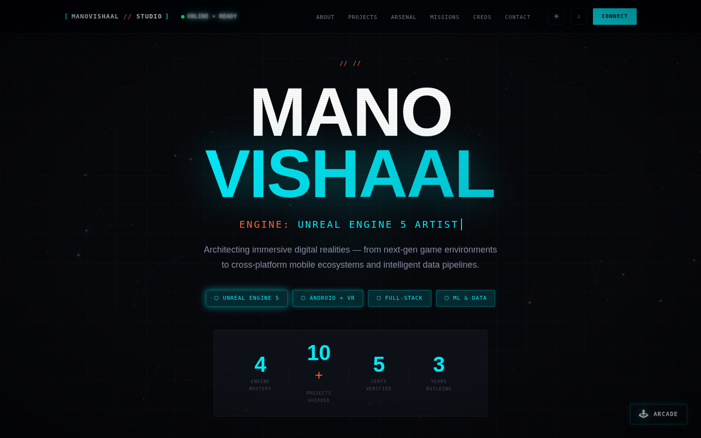
</p>

---

# Overview

This is a single-page portfolio/résumé site built entirely in vanilla HTML, CSS, and JavaScript — no framework, no build step, no backend. It leans hard into a "retro sci-fi HUD" aesthetic: a boot-sequence intro, scanline/CRT overlays, a mouse-reactive constellation canvas background, glitch text, and terminal-style section labels (`// 01`, `// 02`, …). Under the styling is a fully responsive, accessible single-page app: a sticky nav with scroll-spy, a filterable project vault with detail modals, animated skill bars, a reveal-on-scroll timeline, a verified-credentials grid, a contact form, and a self-contained canvas arcade game.

# Tech Stack

| Layer | Technology |
|---|---|
| Markup / Styling | Semantic HTML5, CSS3 (custom properties, Grid/Flexbox, no framework) |
| Behavior | Vanilla JavaScript (ES6+, `IntersectionObserver`, Web Audio API, Canvas 2D) |
| Fonts | Google Fonts — Space Grotesk, Syne, Inter, JetBrains Mono |
| Persistence | `localStorage` (theme preference, saved callsign, local high score) |
| Global Leaderboard | [Supabase](https://supabase.com) (Postgres + Row Level Security) via the `supabase-js` CDN client — no server of your own |
| Build tooling | None — it's static files served as-is |

No `package.json`, no dependencies, no bundler. `index.html`, `styles.css`, `main.js`, `leaderboard.js`, and `game.js` are the entire application.

---

# Project Setup

```bash
git clone https://github.com/Manovishaal/Website.git
cd Website
```

## Running the Project

Since there's no build step, any static file server works:

```bash
# Option 1 — just open it
open index.html          # macOS
start index.html         # Windows

# Option 2 — serve it locally (recommended for the Web Audio API / clipboard APIs, which some browsers restrict on file://)
npx live-server .
# or
python3 -m http.server 5500
```

Then visit the served URL (e.g. `http://localhost:5500`) — the layout adapts from a full desktop HUD down to a mobile hamburger menu. The site works fully offline like this, including the arcade game; only the *global* leaderboard needs the one-time Supabase setup below (without it, the game still tracks a local-only high score exactly as before).

## Project Structure

```
Website/
├── index.html        # All markup: nav, hero, about, projects, skills, timeline, certs, contact, modals
├── styles.css         # Full visual system: HUD theme, light/dark tokens, responsive breakpoints
├── main.js             # Canvas background, audio engine, nav, modals, animations, theme toggle, contact form
├── leaderboard.js        # Supabase client + callsign/high-score helpers for the global leaderboard
├── game.js                 # Decima Defender — the arcade mini-game (calls into leaderboard.js)
├── screenshots/               # Screens referenced in this README
├── demo/                        # Demo walkthrough video referenced in this README
└── README.md
```

---

# Global Leaderboard Setup

The arcade game now has a **public, world-visible high score board**: when you enter the game for the first time you're asked for a callsign, and every completed run submits your score to a shared board that anyone — any visitor, on any device — can open from the 🏆 LEADERBOARD button in the game's header. It's backed by a free [Supabase](https://supabase.com) project. Setup takes about five minutes and there's nothing to host yourself.

1. **Create a project** at [supabase.com](https://supabase.com) (the free tier is plenty for this).
2. **Create the table.** Open the SQL editor and run:

   ```sql
   create table public."HighScores" (
     id bigint generated always as identity primary key,
     "Username" text not null check (char_length("Username") between 1 and 20),
     "Score" integer not null check ("Score" >= 0 and "Score" <= 999999),
     "Level" integer not null default 1 check ("Level" >= 1 and "Level" <= 999),
     "CreatedAt" timestamptz not null default now()
   );

   alter table public."HighScores" enable row level security;

   -- Anyone can read the board (that's the point — it's public)
   create policy "Public read access"
     on public."HighScores" for select
     using (true);

   -- Anyone can submit a score (no login system for a portfolio arcade game)
   create policy "Public insert access"
     on public."HighScores" for insert
     with check (true);
   ```

3. **Copy your credentials.** In *Project Settings → API*, copy the **Project URL** and the **anon/public API key**.
4. **Paste them into `leaderboard.js`** — replace the two placeholder constants near the top of the file:

   ```js
   const SUPABASE_URL = 'YOUR_SUPABASE_URL';
   const SUPABASE_ANON_KEY = 'YOUR_SUPABASE_ANON_KEY';
   ```

That's it — no edge functions, no server. Until you do this, the site still works perfectly; `leaderboard.js` detects the placeholders and every call quietly no-ops (with a console warning), so the arcade game plays exactly as it did before, just without the public board.

**Note on trust:** like most simple browser arcade leaderboards, scores are submitted directly from the client, so this isn't tamper-proof — a determined visitor could POST a fake score with browser dev tools. The `CHECK` constraints above cap scores to a sane range, which stops the most obvious abuse, but true anti-cheat (e.g. validating the score server-side against a replay of the run) is out of scope for a portfolio piece. If that ever matters, moving score submission into a Supabase Edge Function that re-simulates or sanity-checks the run would close that gap.

---

# Demo Video

<video src="demo/website_demo.mp4" controls width="480"></video>

A ~60-second walkthrough: the retro boot sequence, the light/dark theme toggle, the filterable project vault and its detail modal, animated skill bars, the experience timeline, the certifications grid, filling out and submitting the contact form, and a quick round of the built-in Decima Defender arcade game.

---

# Core Features

### Retro Boot Sequence
On load, a terminal-style boot overlay prints a fake system log ("LOADING GAME ENGINE MODULES...", module checks, "PROFILE READY — WELCOME, OPERATOR") before fading out — set the tone in the first three seconds.

### Animated Canvas Background
A `<canvas>` layer renders a mouse-reactive particle field: dozens of glowing points drift and connect with faint lines when close together, gently repelled by the cursor, plus a subtle grid overlay and CRT scanline/vignette effects layered on top.

### Light / Dark Theme Toggle
A single button flips every color token via a `data-theme` attribute and CSS custom properties, with the choice persisted to `localStorage`. The toggle has its own spin animation timed to swap the icon mid-rotation.

### Web Audio Sound Design
An optional audio layer (off by default) synthesizes short tones on the fly with the Web Audio API for hovers, clicks, modal open/close, and toasts — no audio files, just oscillators and gain envelopes.

### Titles Vault — Filterable Projects
Eight project cards (Game & VR, Mobile, Web, Data & ML) can be filtered by category. Clicking a card opens a detail modal with the full tech stack, description, and a bulleted list of key systems. A card can optionally surface an action button in its modal: the Sitara Apt Portal card links out to that project's live demo, and the Cato Kids card links to a downloadable Android APK release.

### Arsenal Matrix — Animated Skills
Category-grouped skill bars animate to their target percentage the first time the section scrolls into view (via `IntersectionObserver`), backed by a scrolling tech-badge cloud with a randomized glow cycle.

### Mission Logs — Experience & Education Timeline
A scroll-reveal timeline covering work experience and education, each entry in its own HUD-styled panel with tags and dates.

### Verified Credentials
A grid of certification cards (issuer, description, skill tags) for UE5, terrain/environment art, SQL, Excel/data analytics, and Android development.

### Command Center — Contact
A contact panel with clickable email/phone/LinkedIn/GitHub links (each with a one-click copy-to-clipboard button) alongside a validated contact form. Submission is currently simulated client-side with a success toast — see [Notes](#notes) below.

### Arcade Mini-Game — Decima Defender
A fully playable canvas shoot-'em-up reachable from the hero CTA or a floating arcade button (or the Konami code, anywhere on the site: `↑ ↑ ↓ ↓ ← → ← → B A`). Move and fire at Bugs, Viruses, Glitches, and Crashes for points, with levels, particle effects, synthesized sound effects, and pause.

### Global Leaderboard
First-time players are asked for a callsign (skippable — you're auto-assigned a `GUEST-####` tag instead); it's remembered locally so you're not asked again. Every completed run submits your score to a public, Supabase-backed board that any visitor can open — even without playing — from the 🏆 LEADERBOARD button. See [Global Leaderboard Setup](#global-leaderboard-setup) below to wire up your own Supabase project; until then the game plays identically, just without the public board.

### Fully Responsive
A collapsing hamburger menu, stacked layouts, and touch-friendly controls (including touch-move support for the arcade game) take the site from a wide desktop HUD down to mobile.

---

# Screens

## Hero — Dark & Light Themes

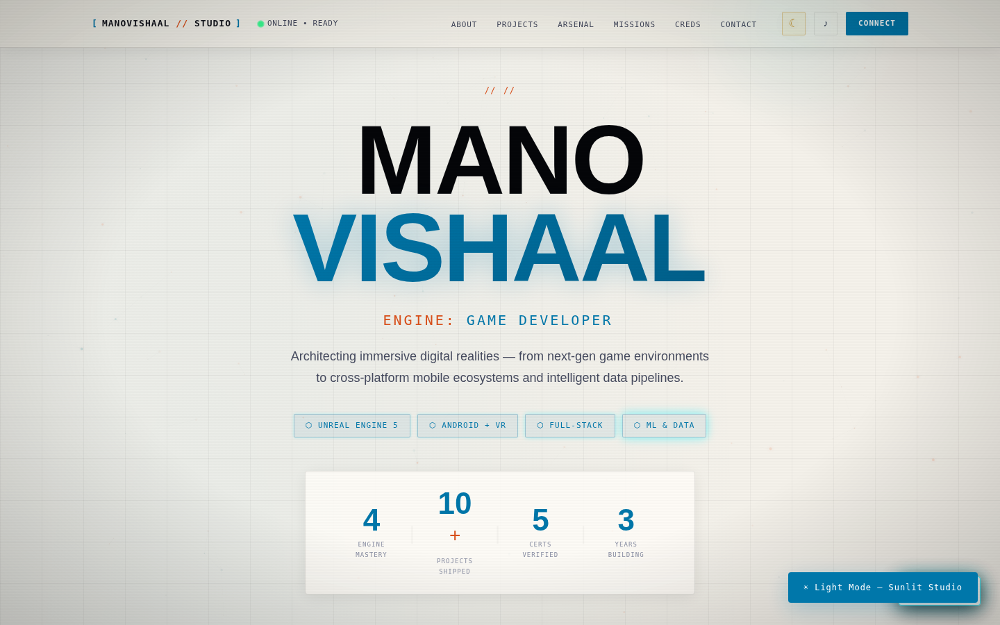

The animated telemetry counters (Engine Mastery, Projects Shipped, Certs Verified, Years Building) count up on scroll; the theme toggle swaps every token instantly.

## Studio Briefing (About)
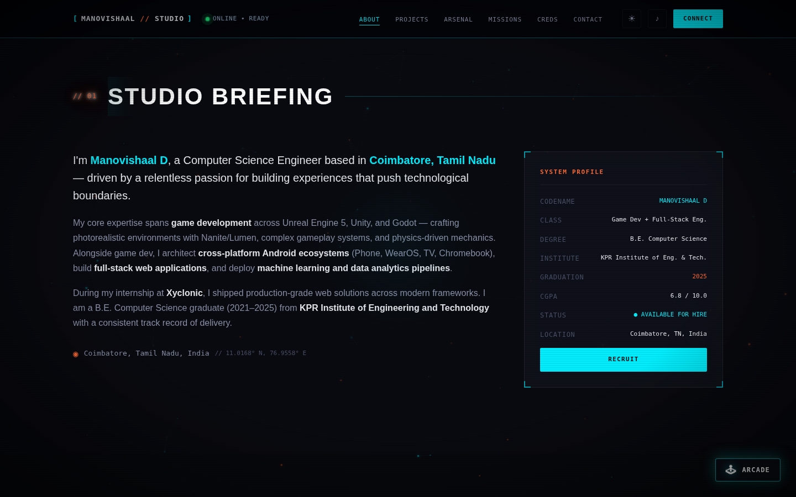

## Titles Vault (Projects)
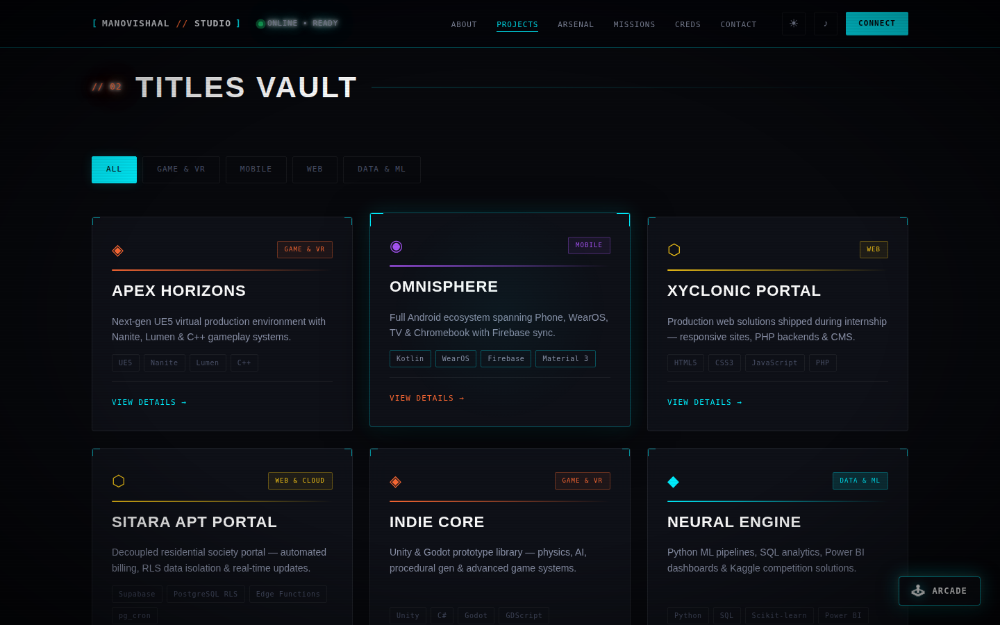

## Project Detail Modal
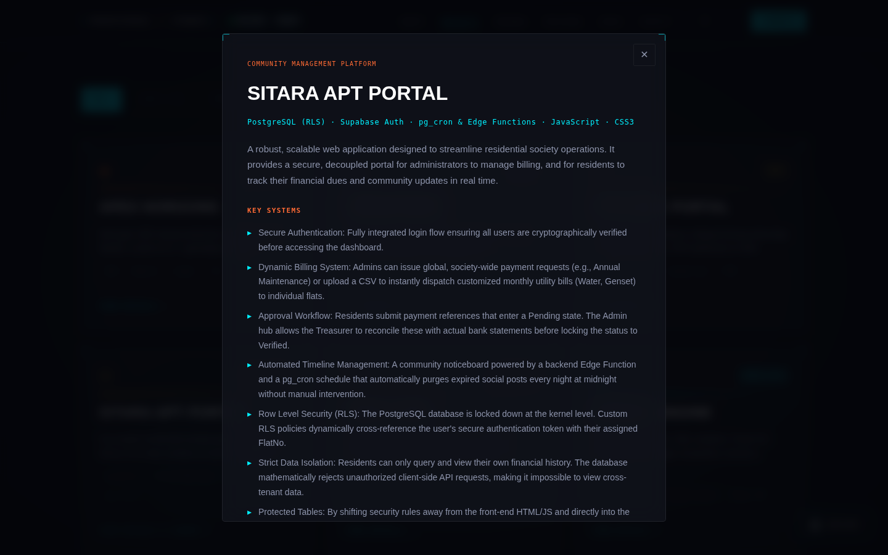

## Arsenal Matrix (Skills)
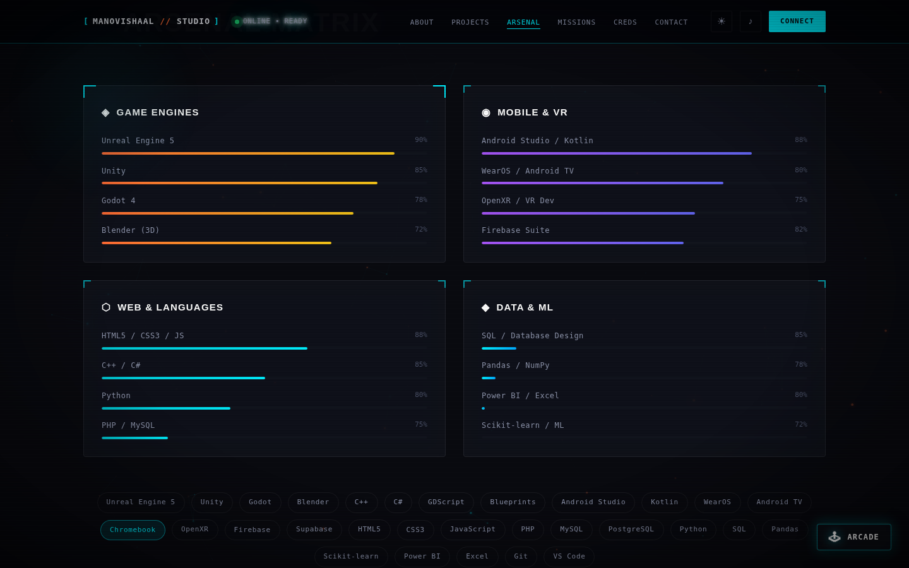

## Mission Logs (Experience & Education)
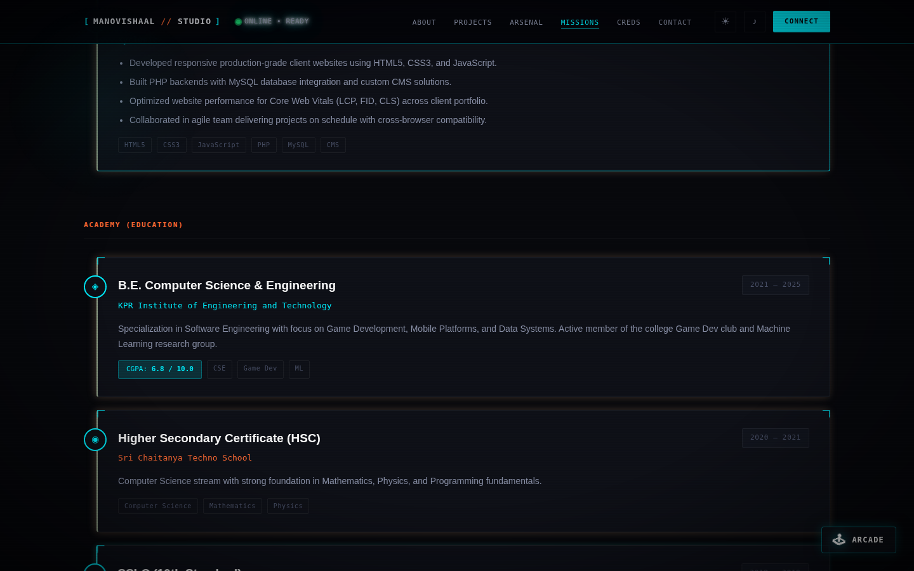

## Verified Credentials (Certifications)
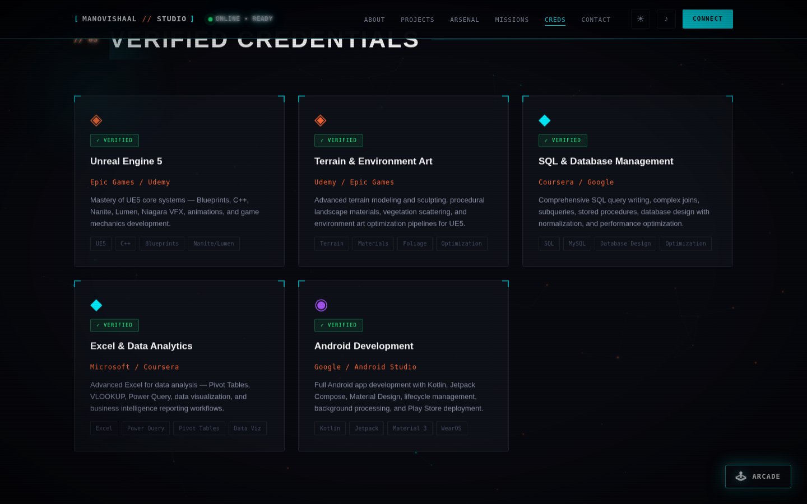

## Command Center (Contact)
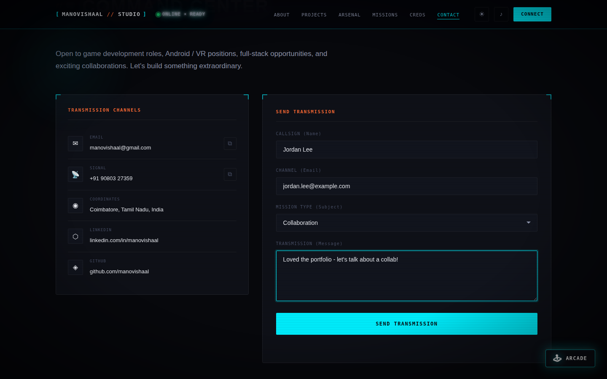

## Arcade — Decima Defender
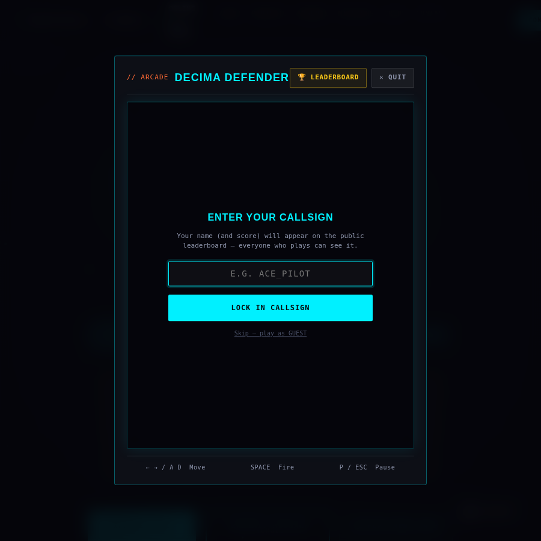
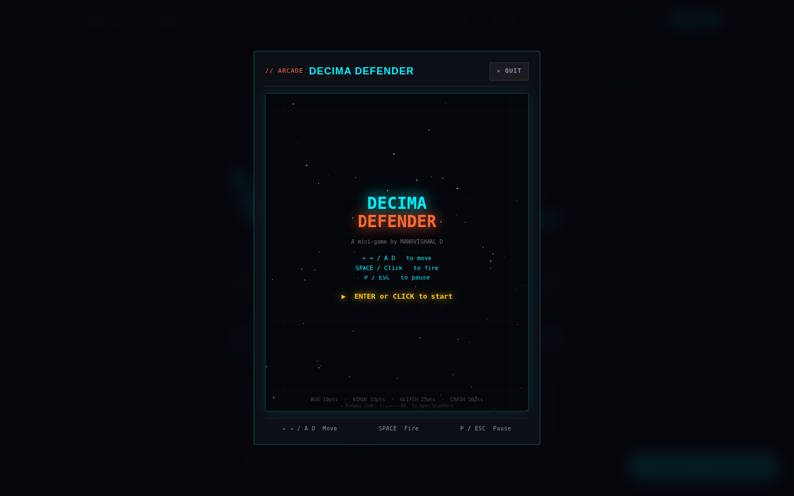
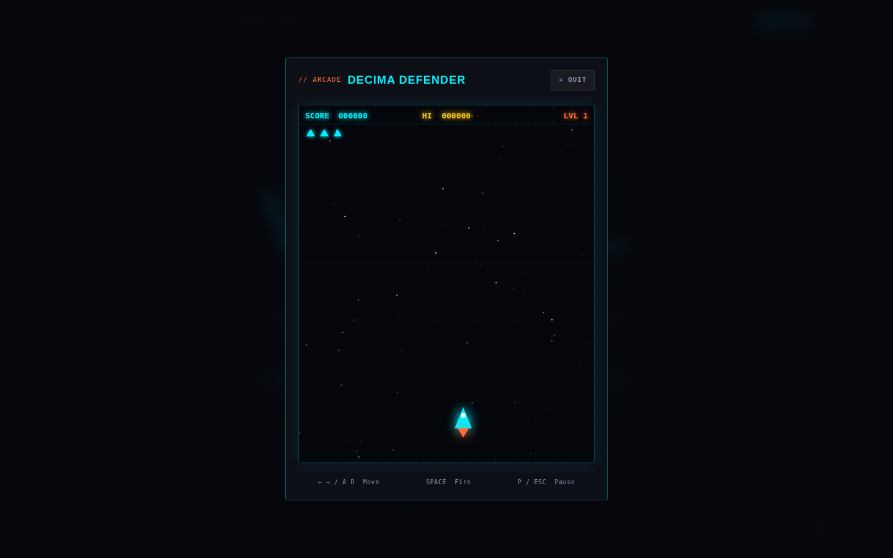
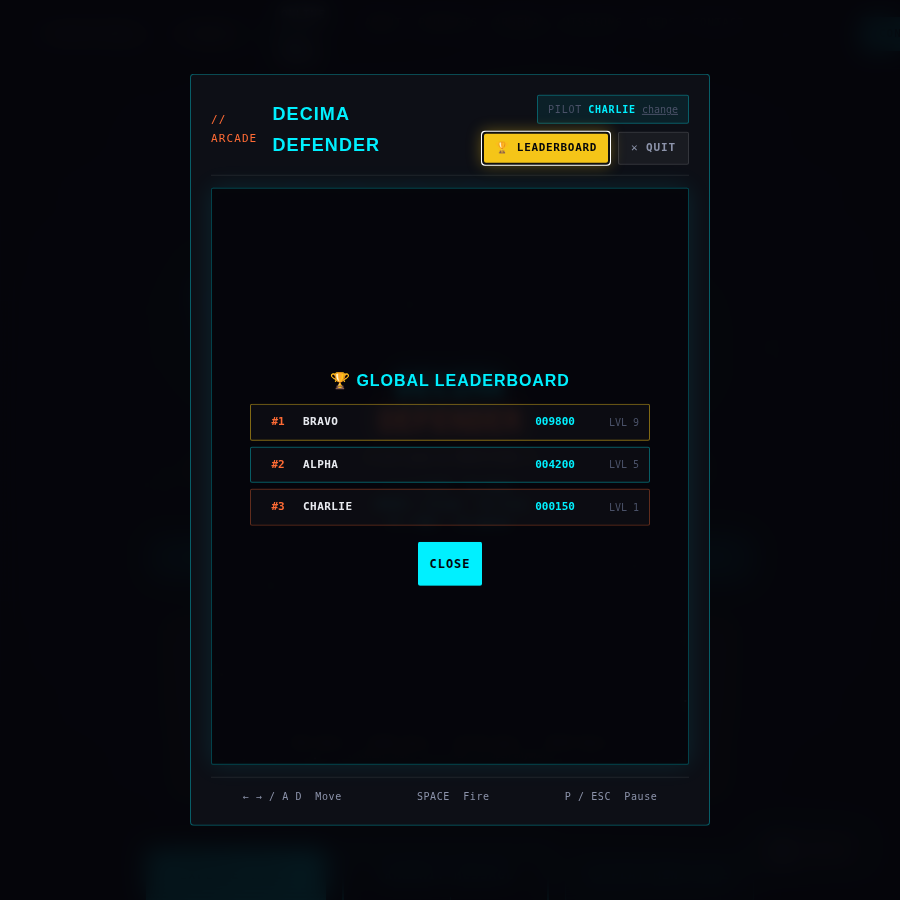

## Mobile Navigation
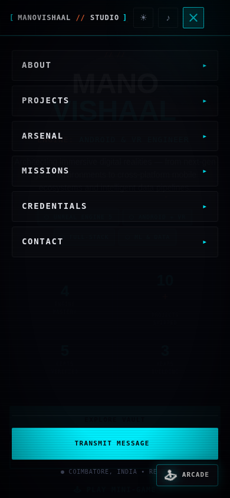

---

# Notes

- The contact form validates input and shows a success toast, but submission is currently simulated client-side (see the comment in `main.js`: *"Simulate submission (replace with real backend/emailJS/formspree)"*). Wiring it to EmailJS, Formspree, or a real backend would make it functional.
- Sound effects are off by default (toggle in the nav) since autoplaying audio is broadly restricted by browsers until a user gesture occurs.

# Roadmap

- Connect the contact form to a real email/backend service.
- Add project screenshots/GIFs directly into each modal.
- Expand the arcade game with additional enemy waves.
- Harden the leaderboard against spoofed scores (e.g. server-side run validation via a Supabase Edge Function).

---

<p align="center">Built by Manovishaal D — Coimbatore, Tamil Nadu, India.</p>
